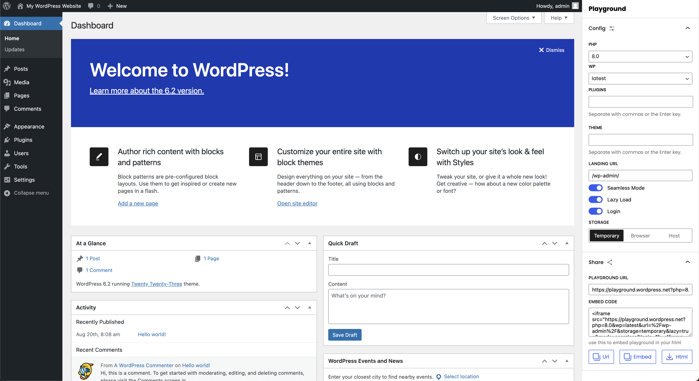

# WordPress Playground Generator
UI Tool to generate WordPress Playground URL, embed and HTML Code

## Usage
- Visit https://wp-playground-generator.pages.dev/
- Config settings in sidebar and view the live preview
- Copy url, embed code or download html to share

## Development 
- Clone this repository `git clone https://github.com/lubusIN/wp-playground-generator`
- Open project directory `cd wp-playground-generator`
- Install dependencies`npm install`
- Run dev `npm run start`
- Run build `npm run build`

## Credits

[Ajit Bohra](https://twitter.com/ajitbohra)

## Meet Your Artisans 
[LUBUS](http://lubus.in) is a web design agency based in Mumbai, India.

## License

`WP Playground Generator` is an open-source software licensed under the [MIT](LICENSE)